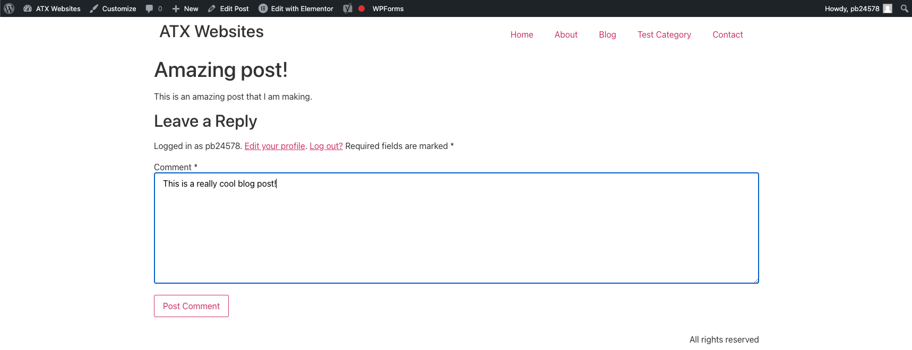
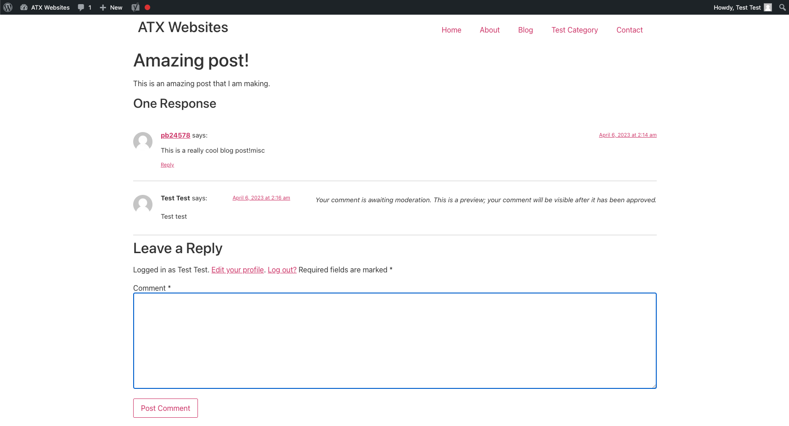
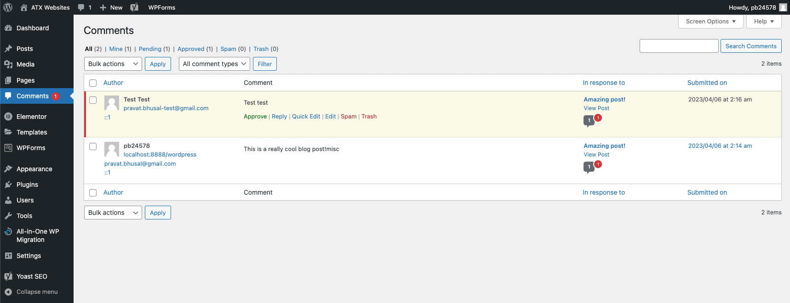

# Comments
Comments allow your website's visitors to have a discussion with you and each other. If you activate comments on a page, then Wordpress inserts a text input box to allow your users to comment on a blog post.

You can approve or decline a user's comment. Once you approve a comment, it will pear undernear your post content.

### Creating Comment
If a user visits your blog post, then they can post a comment:

If a contributor user tries to make a comment, then their comment will be awaiting moderation:

### Comments Dashboard
In your Comments dashboard, you can see all of the comments posted on your website and also the post that the comment originated from.

The actions you can perform in the comments dashboard:
1. Approve/decline comments made from contributor users
2. Reply to a comment
3. Select a comment as spam

### Akismet
Sometimes a spammer might join your website and try to post a bunch of spam comments to attack your Wordpress website. To prevent this, you can install the [Akismet](https://akismet.com/) Wordpress plugin. You can get an API key for free if you have a personal website that does not generate revenue.