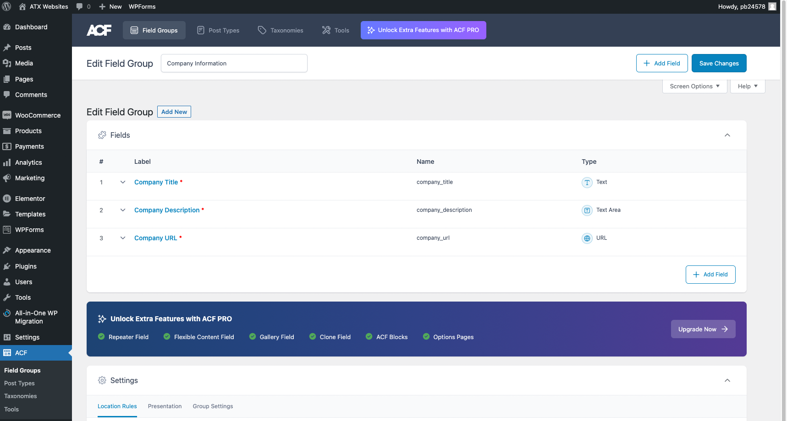
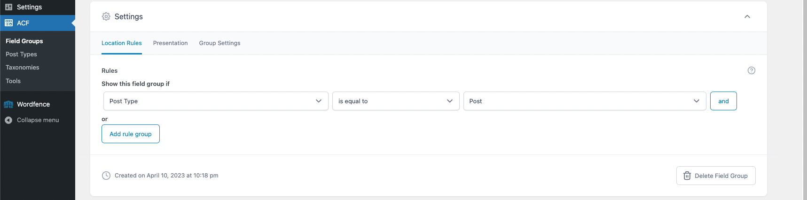
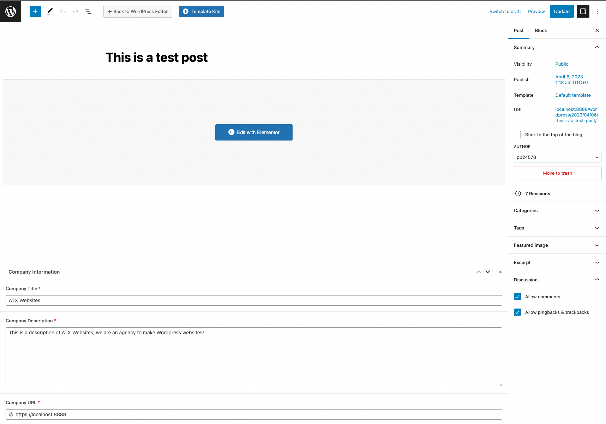
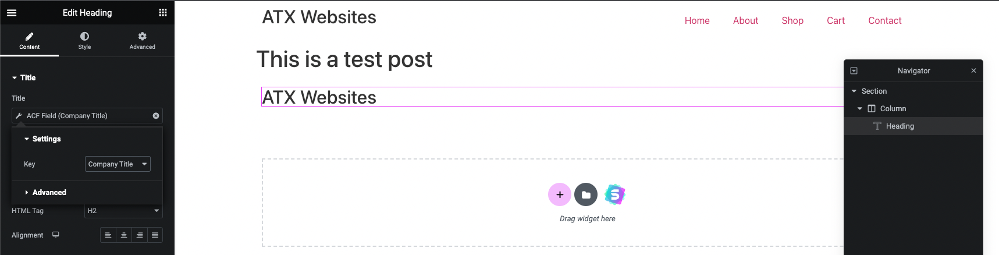
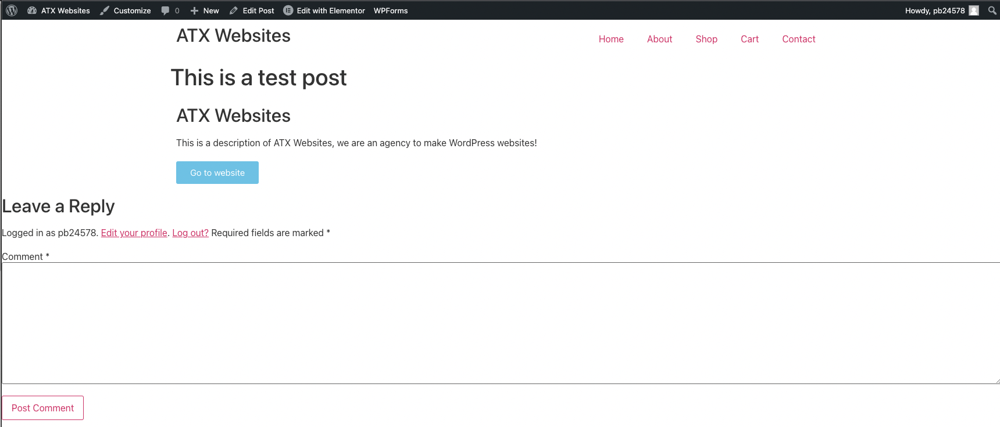

# Advanced Custom Fields (ACF)
[ACF](https://www.advancedcustomfields.com/) is a plugin that lets you customize WordPress edit screens and field data to posts, users, taxonomy terms, media, comments, and even custom options pages.

To view a list of the custom fields offered by ACF, visit: https://www.advancedcustomfields.com/resources/#field-types/

### Create Field Group
A field group is a collection of fields that are grouped together.

For example, I created a field group called "Company Information" that contains a Company Title, Company Description, and Company URL:

Then, you can specify the rules to when to display the field group. For example, I want to display the "Company Information" field group only when the post type is "Post":

Now if you edit a post, you will see the "Company Information" field group:

### Set Custom Fields with Elementor
You can set the custom field values with Elementor.

For example, I added a Title widget to a post and set the Title as a dynamic tag to the "Company Title" field:

Here's the final product of a blog post the custom fields from "Company Information" field group:

