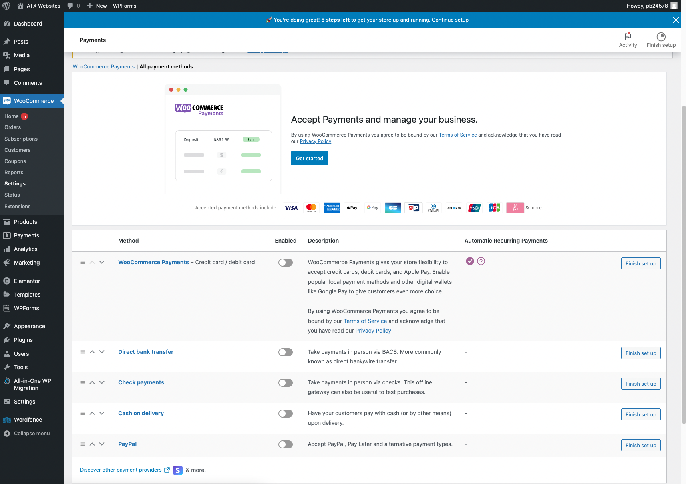
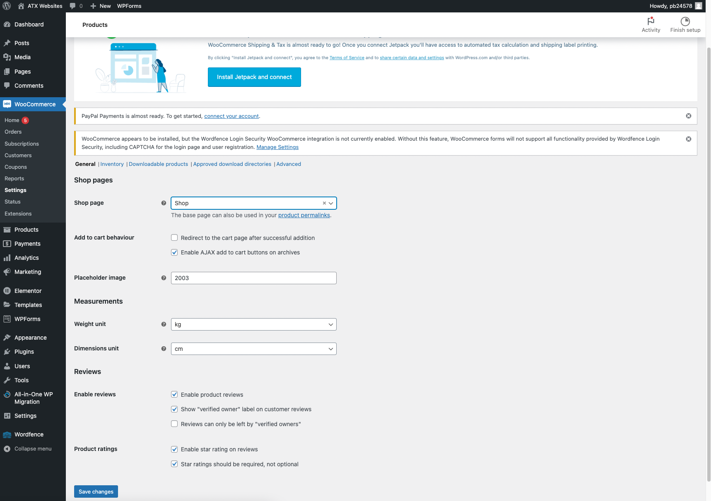
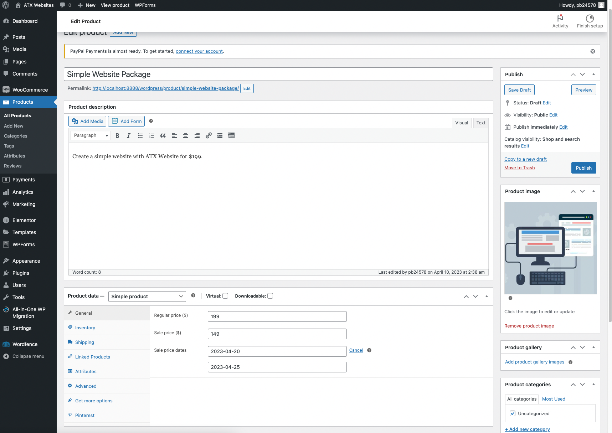
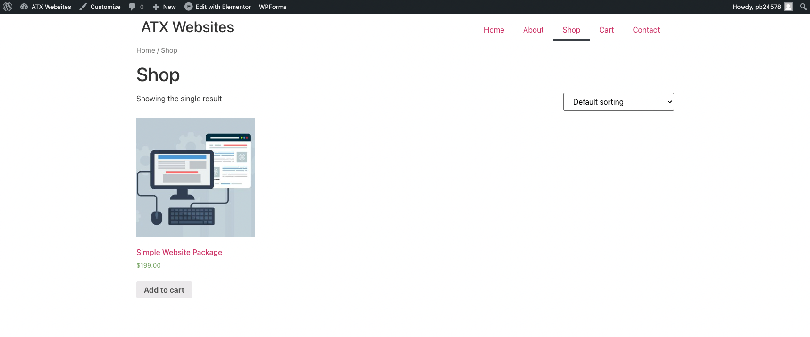
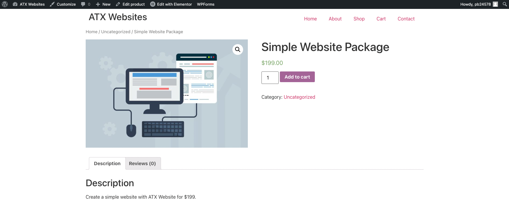
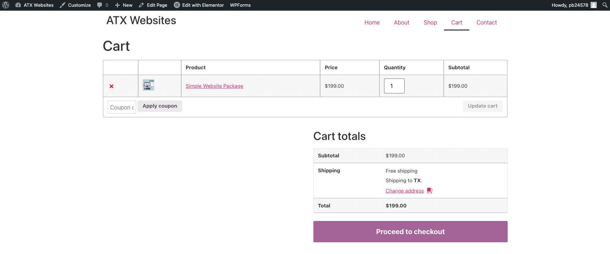

# WooCommerce
[WooCommerce](https://woocommerce.com/) is a plugin that enables e-commerce on your Wordpress website. The [features of WooCommerce include](https://woocommerce.com/woocommerce-features/): secure payment processing, product management, inventory management, shipping, and tax management.

WooCommerce is the most popular e-commerce platform with an ever-increasing adoption rate. Unlike Spotify, WooCommerce is open-source and is built around the community of developers that integrate with the platform. There are over 50,000 plugins and extensions that can be used to extend the functionality of WooCommerce. With a WooCommerce store, you have complete freedom on the store and can pay for free or premium extensions to add more features.

### WooCommerce Theme
WooCommerce only works with a supported theme. Typically, many of the popular Elementor themes also support WooCommerce integration. For a list of supported popular themes:
1. [Storefront](https://woocommerce.com/storefront/) - Official theme of WooCommerce
2. [Astra](https://wpastra.com/) - Official theme of Elementor
3. [Hello](https://elementor.com/products/hello-theme/) - Highly customizable Elementor theme

### Payment Settings
WooCommerce has a wide range of payment options. In WooCommerce -> Settings -> Payments, you can use the following payment gateways:

### Products Settings
WooCommerce has a wide range of product options. In WooCommerce -> Settings -> Products, you can set the Shop page, weight unit, dimensions unit, and more:

### Create Product
To create a product, go to Products -> Add New. You can set the product name, price, description, and more.

Here I created a "Simple Website Package" product for a client to purchase a website from me:

If you go back to the website, in the "Shop" page, you can see the product:

The shop page is determined by the theme you're using, in this example I am using the "Hello" theme by Elementor.

If you click on the item, you can view the product:

And then you can add the product to the cart, then head over to the Cart page:

### MonsterInsights Analytics
[MonsterInsights](https://www.monsterinsights.com/) is a plugin that integrates Google Analytics with your WordPress website. It is the most popular Google Analytics plugin for WordPress.

Unfortunately, you'll need to pay the premium version of MonsterInsights to see the e-commerce WooCommerce data. The free version only supports data from Google Analytics for your website's traffic.