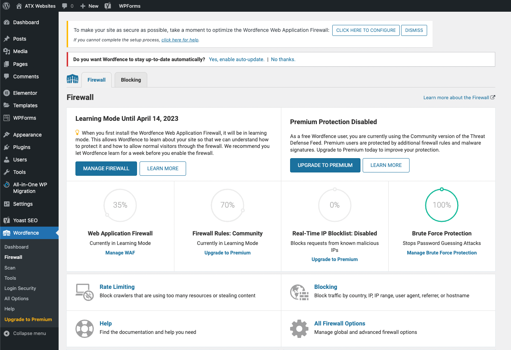
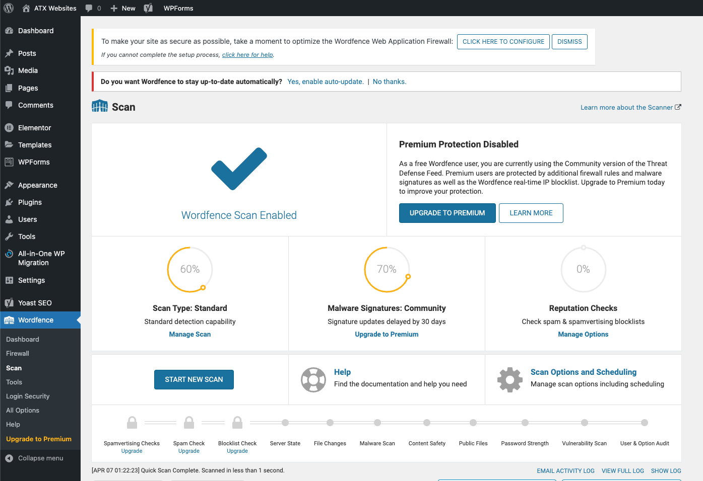
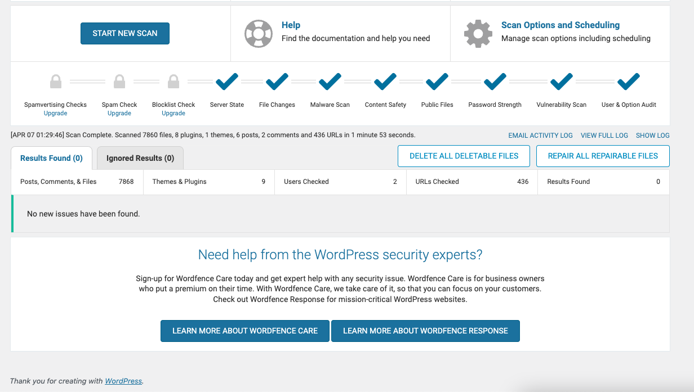
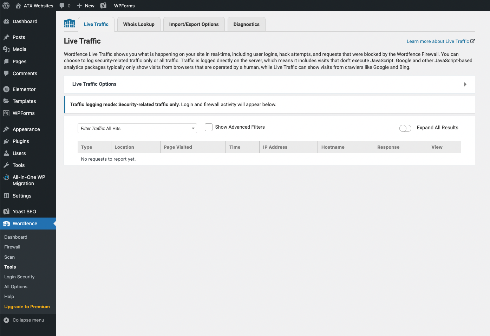
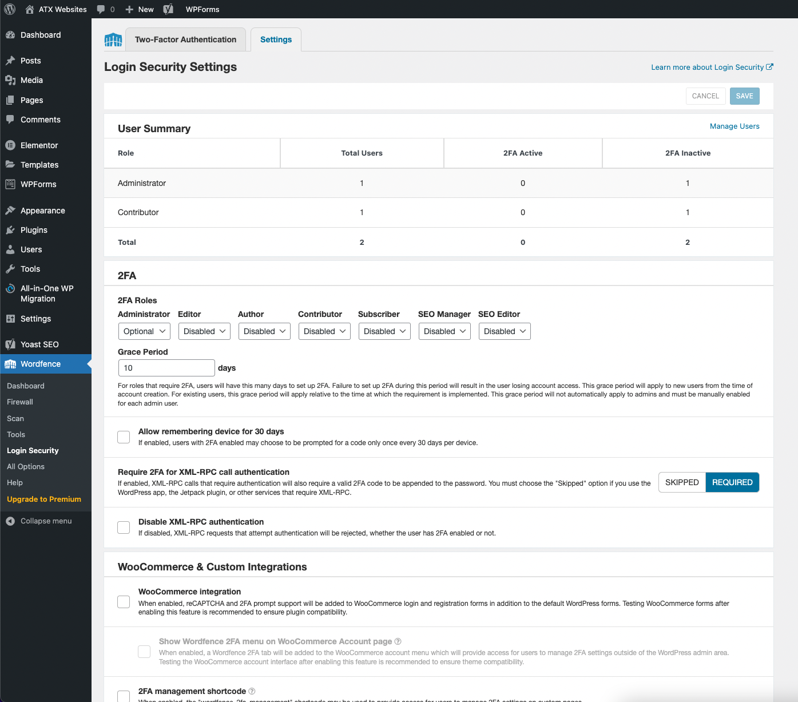
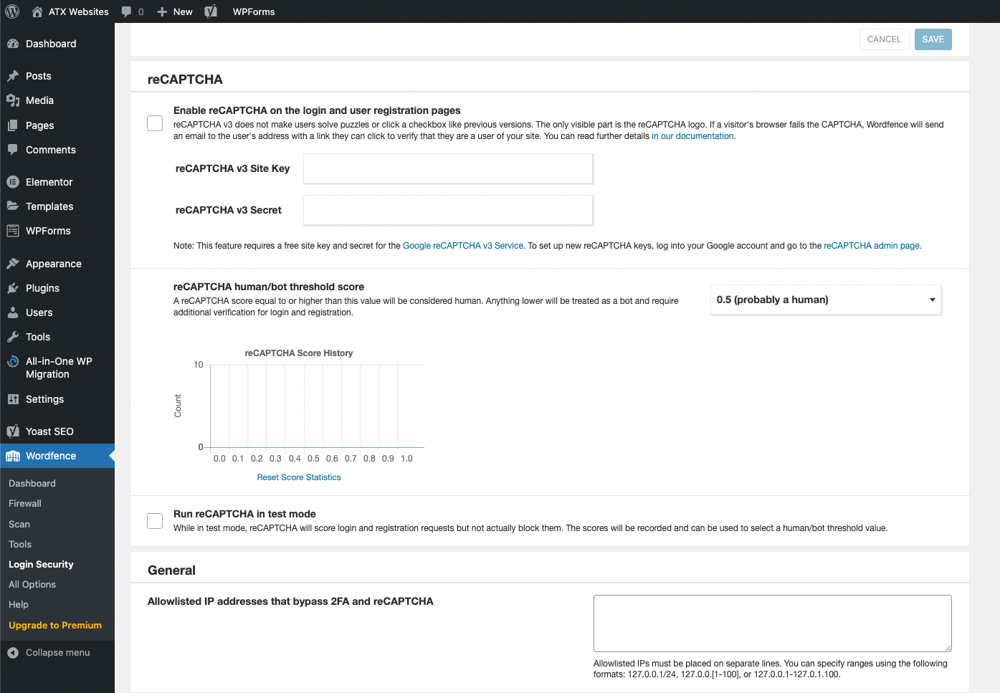

# Wordfence
[Wordfence](https://www.wordfence.com/) is a security plugin for Wordpress. It provides a firewall, login security, malware scanning and more.

### Firewall
The firewall protects your site from malicious traffic. It blocks attacks by scanning all requests and comparing them to a list of known bad requests. It also blocks requests from IP addresses that have been flagged as malicious by other Wordfence users.

### Scan
The scan feature scans your site for malware and other security issues. It can scan your entire site or just the files that have changed since the last scan. It can also scan your themes and plugins for known vulnerabilities.

After scanning my basic website, Wordfence found no vulnearabilities:

### Live Traffic
Live traffic shows you the requests that are currently being made to your site. It shows you the IP address, the request type, the URL, the user agent, and the time of the request.

### Login Security
Login security protects your site from brute force attacks. It blocks IP addresses that have made too many failed login attempts. The features include reCAPTCHA, two-factor authentication, and allowlisting IP addresses to bypass 2FA and reCAPTCHA. It also includes WooCommerce integration to support WooCommerce login and registration forms.

