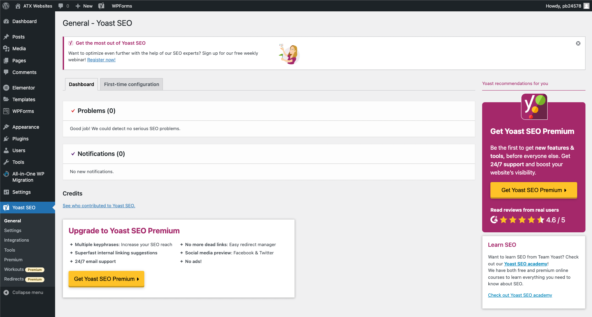
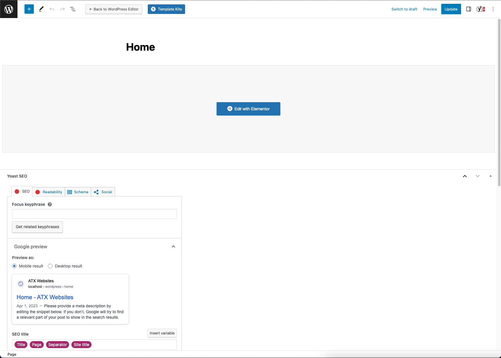
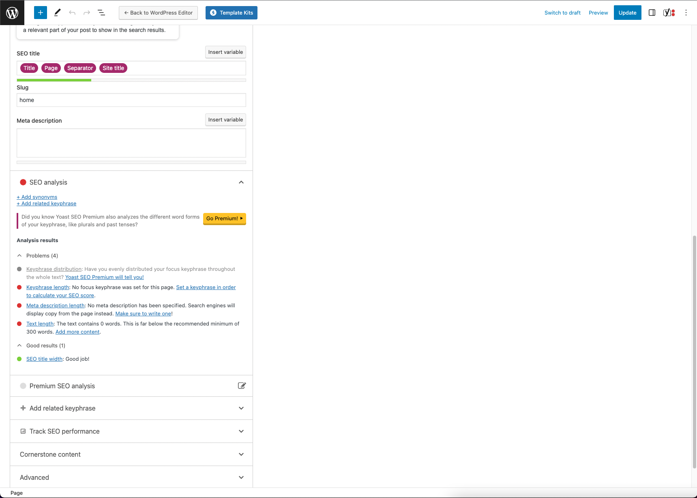
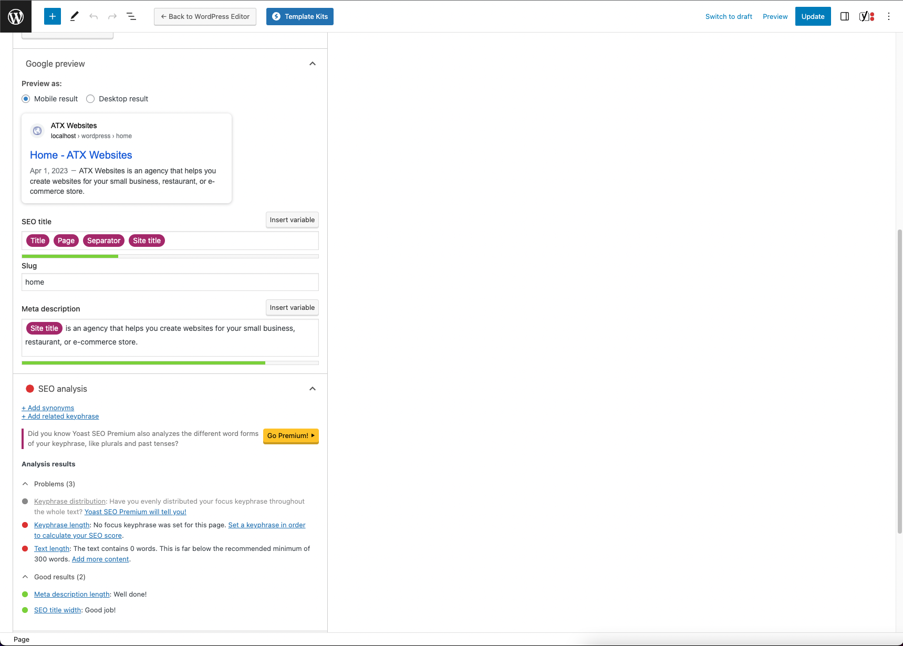
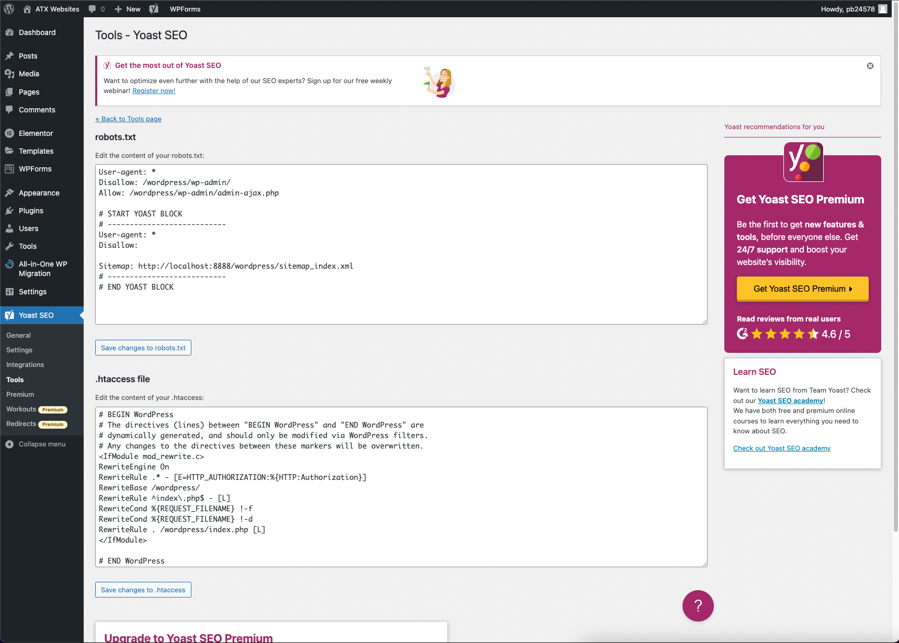

# Yoast
[Yoast](https://yoast.com/) is a plugin for search engine optimization (SEO).

The plugin appears on each of the pages and posts you create on Wordpress, then analyzes those page's contents, calculates an SEO score, and provides suggestions on how to improve them. Yoast is great for training yourself to follow the best SEO practices, and it'll continously give you updated info about your website's content. 

Yoast will also optimize your website automatically, providing hidden features such as:
1. Structured data for your pages, helping Google understand them better
2. Creates XML sitemap (lists all the pages on a website) helping search engines index your pages by submitting it to Google Search Console
3. Provides redirects when you move or delete content to avoid dead ends

Read a list of their hidden features here: https://yoast.com/yoast-seo-hidden-features/

### Yoast Dashboard
The dashboard shows your SEO problems with recommendations and notifications from Yoast:

This is good to check up on every time you make an edit to your website to ensure it's fully SEO optimized.

### Yoast Site Features
Yoast comes with Site features to enable SEO if your website supports certain features.

For example, there is a feature for [Readability analysis](https://yoast.com/does-readability-rank/), which analyzes how "readable" your website is for search engines and offers suggestions to make your website more readable. This can include how well it integrates with Google's voice search, logical ordering of topics, are sentences short and simple, etc. Google likes plain and understandable language.

### Yoast Page Suggestions
If you go to edit a page, then the plugin will show you page suggestions to help improve the SEO. See for example with the home page:

Following these suggestions will help you improve your site's SEO. For example, let's add a Meta description about our website:

Now search engines will show a pre-defined meta description about our page without having to crawl text from our page.

### robots.txt and .htaccess
There are two types of directives: crawler (robots.txt) and indexer (.htaccess) directives. Crawler directives tell the search engine where it can go and pinpoint to its sitemap. Indexer directives tell the search engine what it should index.

The robots.txt tells search engine crawlers which URLs the crawler can access on your site. This is used mainly to avoid overloading your site with requests; it is not a mechanism for keeping a web page out of Google.

The .htaccess is an Apache web server file to apply configurations to a directory and its sub-directories from where it exists. For example, it can make SEO-friendly URLs by changing `https://site.com/index.php?topic=article` to `https://site.com/rules/article` using a Rewrite Rule.

If you go to Tools --> File Editor, then you will see your website's robot.txt and .htaccess files that Yoast has set:

