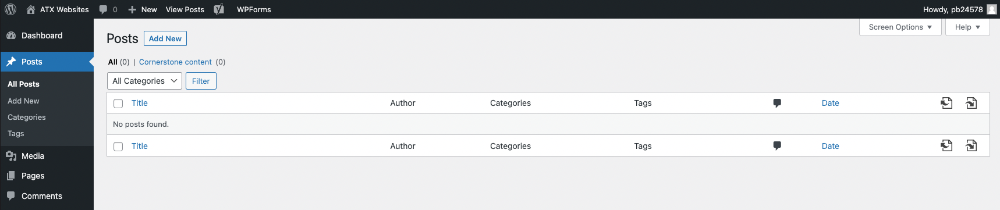
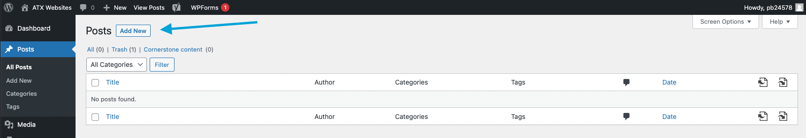
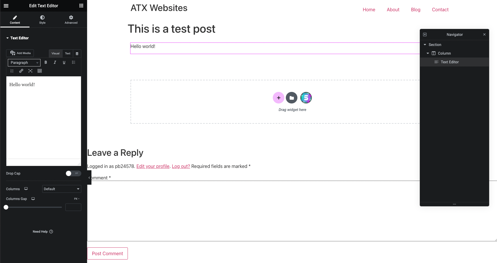
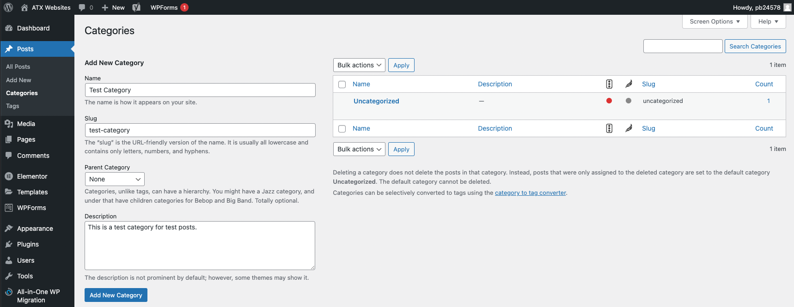
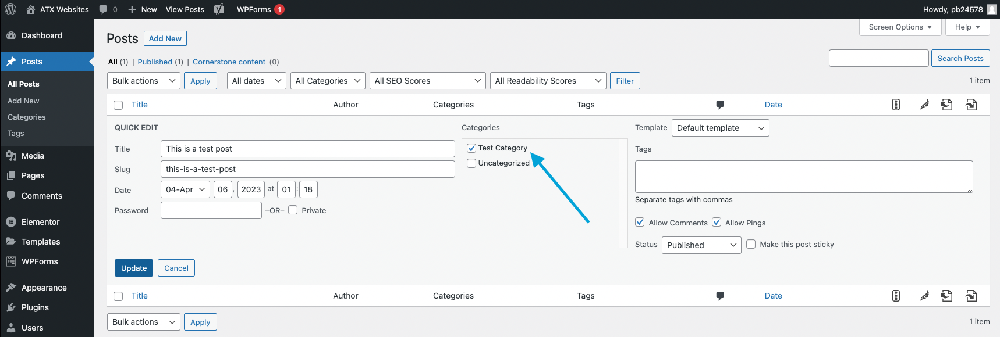
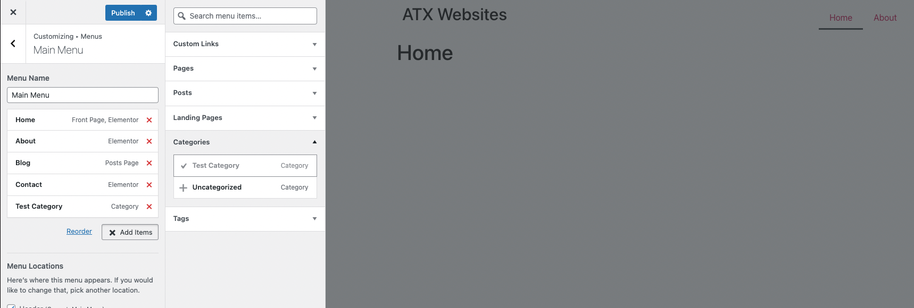
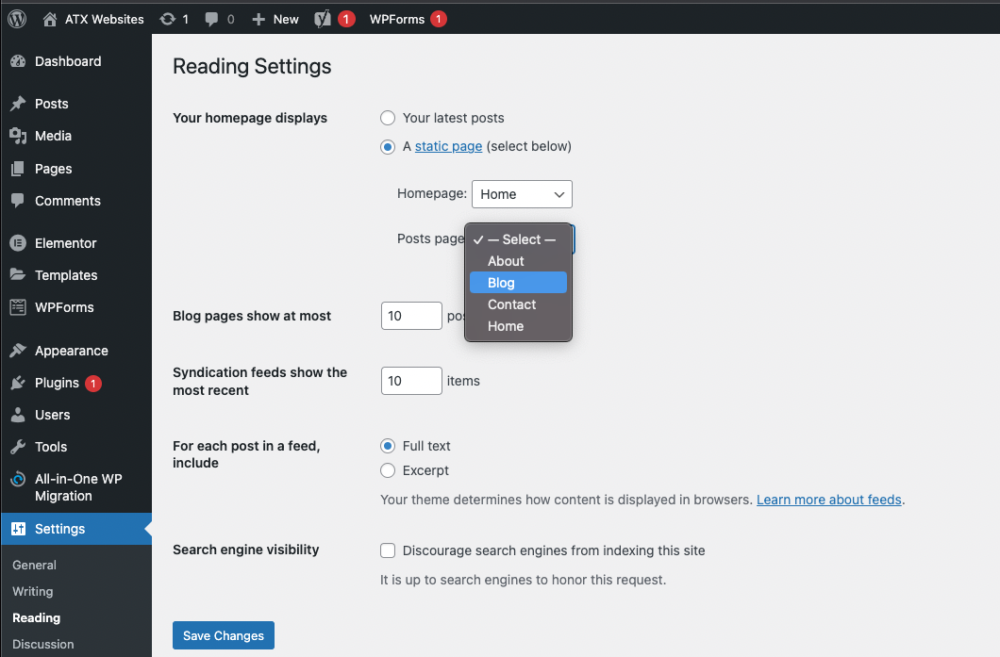
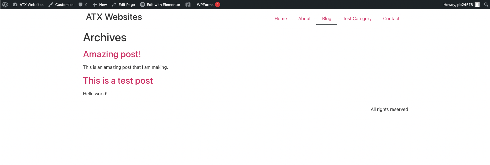

# Posts
Wordpress posts contains content written in order of publication for a blog, and posts can be arranged and categorized. Below is the Wordpress dashboard to showcase your posts:

### Create Post
To create a post, in your Posts dashboard click the "Add New" button:

Now create a Post, you can use the Elementor plugin to edit your post:

### Create Category
A post can be categorized, which helps organize the type of post it is for your blog. Let's create a new category called "Test Category":

Now let's classify our test posts in that Test Category:

We can also add the Test Category in our theme menu:

### Blog Page
The blog page is where you see a list of the posts. To set the blog page, you can in the Wordpress -> Reading -> Posts page settings:

Going over to our blog page, you can see all of the posts that you created on there:

To see only the Test Category categorized posts, go to the Test Category page:

