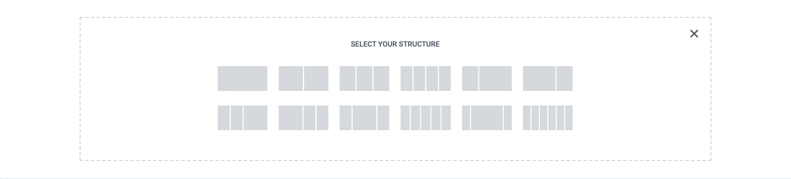

# Elementor
[Elementor](https://elementor.com/) is a Wordpress plugin to build your website using drag-and-drop through a visual editor.

This YouTube video is a good tutorial to learn about Elementor: https://www.youtube.com/watch?v=jl8F4WglM3I&t=3948s&ab_channel=TylerMoore

### Installation
Install the "Astra" Wordpress theme and activate it for the website. The Astra template is a fast, fully customizable, and lightweight theme. It is one of the most popular wordpress themes that integrate well with Elementor. Other alternatives are also Divi, Ultra, and OceanWP.

To get a curated catalog of templates that support Elementor, install the https://startertemplates.com/?page-builder=elementor Wordpress plugin.

For testing purposes, you can use the "Planet Earth" template from the Starter Templates marketplace. The template will install the pre-defined pages, plugins (i.e. Elementor), and media.

### Free Elementor Pro
To enable the "Pro" elements from Elementor, you can purchase the Pro license. Pro includes features such as custom CSS, WooCommerce widgets, social media integration, and more.

Purchasing the license is expensive, but you can unlock the features for free using a Wordpress plugin. The PRO Elements plugin enables pro features in Elementor: https://proelements.org/

### Copyright Free Images
To use copyright free images on your website, then you can use these useful websites:
1. midjourney.com - Stable diffusion model that generates AI art
1. pexels.com
2. pixelbay.com
3. unsplash.com

### Elementor Section
Elementor uses [CSS Flexbox](https://elementor.com/help/what-is-a-container/#:~:text=Introducing%20containers,%2C%20columns%2C%20and%20inner%20sections.) to create sections with a column-based structure. Whenever creating a new section on the website, there a few structures to choose from:

