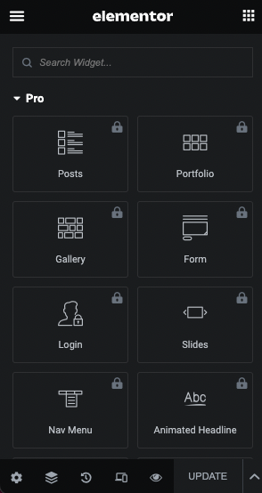
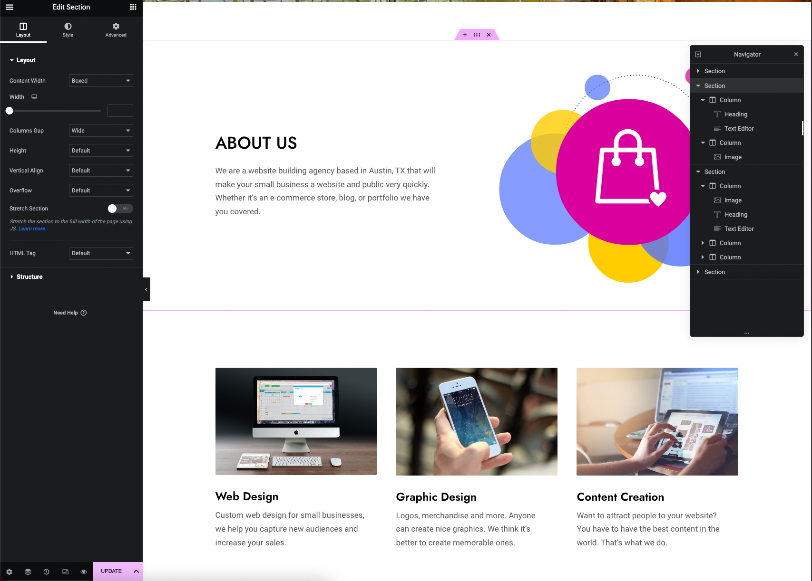
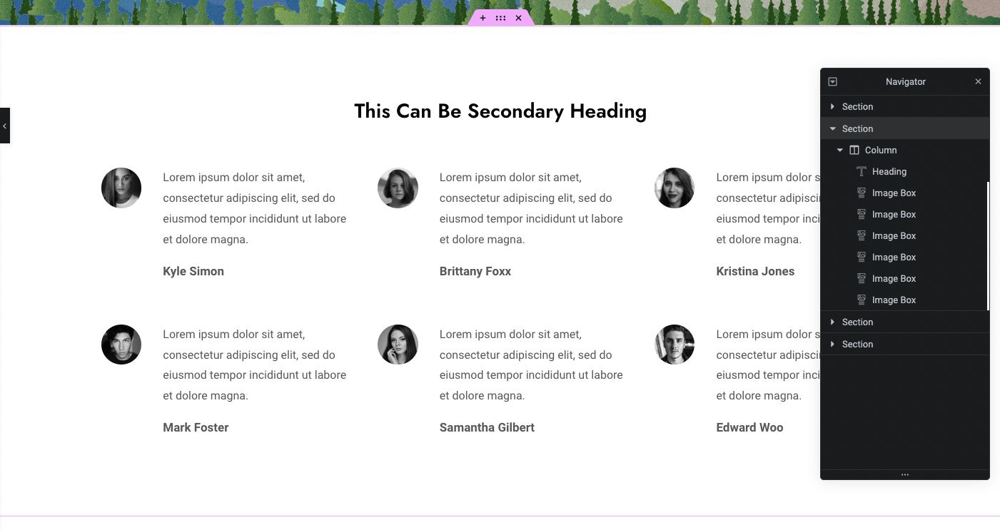
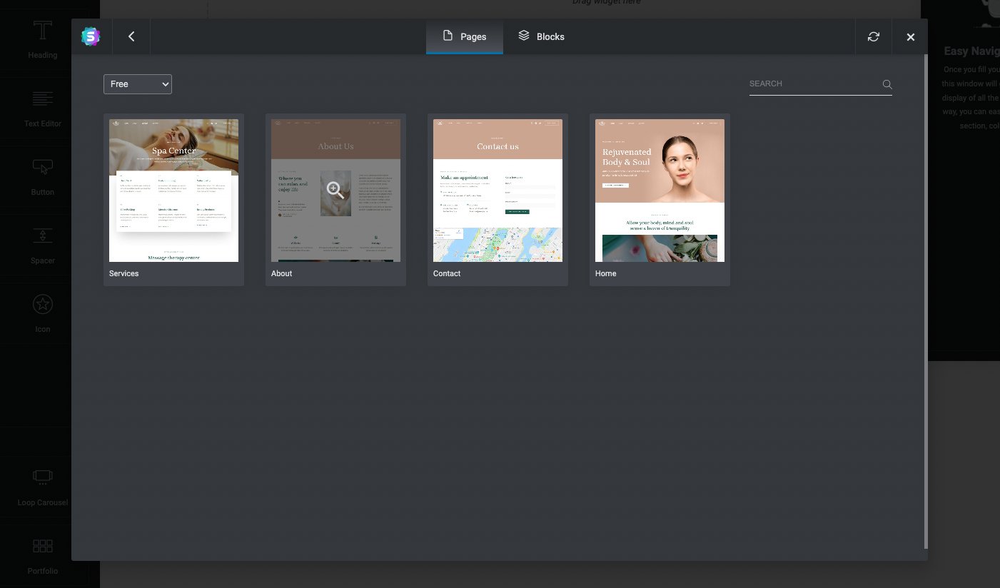
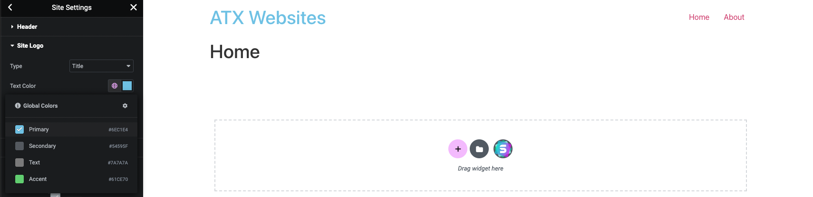
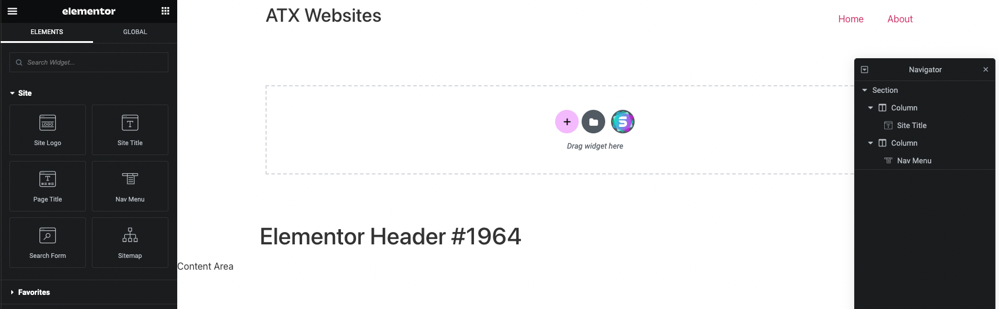

# Elementor
[Elementor](https://elementor.com/) is a Wordpress plugin to build a Wordpress page using drag-and-drop through a visual editor.

This YouTube video is a good tutorial to learn about Elementor: https://www.youtube.com/watch?v=jl8F4WglM3I&t=3948s&ab_channel=TylerMoore

### Installation
Install the "Astra" Wordpress theme and activate it for the website. The Astra template is a fast, fully customizable, and lightweight theme. It is one of the most popular wordpress themes that integrate well with Elementor. Other alternatives are also Divi, Ultra, and OceanWP.

To get a curated catalog of templates that support Elementor, install the https://startertemplates.com/?page-builder=elementor Wordpress plugin.

For testing purposes, you can use the "Planet Earth" template from the Starter Templates marketplace. The template will install the pre-defined pages, plugins (i.e. Elementor), and media.

### Free Elementor Pro
To enable the "Pro" elements from Elementor, you can purchase the Pro license. Pro includes features such as Theme builder, WooCommerce widgets, social media integration, custom CSS, and more.

Purchasing the license is expensive, but you can unlock the features for free using a Wordpress plugin. The PRO Elements plugin enables pro features in Elementor: https://proelements.org/

### Copyright Free Resources
To use copyright free text, images, and videos on your website, then you can use these useful websites:
1. midjourney.com - Free stable diffusion model that generates AI art
2. logomakr.com - Free logo making app
3. pexels.com
4. pixelbay.com
5. unsplash.com

### Elementor Section
Elementor organizes your website using [Sections](https://elementor.com/help/section-overview/). Each section is a [CSS Flexbox](https://elementor.com/help/what-is-a-container/#:~:text=Introducing%20containers,%2C%20columns%2C%20and%20inner%20sections.) with a column structure. Whenever creating a new section on Elementor, there a few structures to choose from:

An example website built using multiple sections:

### Elementor Pre-defined Block
Elementor supports [Blocks](https://elementor.com/blog/introducing-blocks/), which is a pre-designed section template that can be added to your website. Using blocks saves a lot of time because you can use pre-built widgets and edit them to your liking. Elementor considers using blocks "the fastest way to build websites".

When adding a new section with Elementor click the "Starter Templates" icon to bring up a catalog of blocks:

And then once you choose a block, it will be added to the new section such as below:

### Elementor Pre-defined Page
Elementor supports adding entire Wordpress pages from a catalog of pages. We can use the sections of the page to make our website more unique. This significantly speeds up the creation of our website since we can re-use entire pages created by other people.

When adding a new section with Elementor click the "Start Templates" icon and in the "Pages" tab choose a page from the template catalog:

And then once you choose a page, it will be added to the existing page such as below:

### Elementor Pre-defined Kits
[Elementor Kits](https://elementor.com/library/) are full sample websites with pages that you can use on your website. Elementor has a library of kits that you can curate, and you can mix and match the kit pages to create your own unique website.

You can access a library kit's pages from the Library -> Pages tab when adding a new section to your website. See example with the [Digital Marketing Agency Website Kit](https://elementor.com/library/template-kit/digital-marketing-agency/):

### Elementor Responsive Design
Elementor supports [responsive design](https://elementor.com/help/mobile-editing/) for desktop, tablet, and mobile devices for styles that have a Viewport icon in the editor.

For example, the below Text Editor element has a Viewport icon on the alignment style:

This means you can set text alignment to be different on desktop, tablet, or mobile devices.

### Elementor Site Settings
If you are using an Elementor supported theme, then the [Elementor Site Settings](https://elementor.com/help/site-settings/) is Elementor's version of the Wordpress Theme Customizer.

Here you have options to control the Design System which consists of Global Colors and Global Fonts, Theme Builder which consists of Typography, Buttons, Images, and Form Fields settings, Header and Footer customizations (Hello Theme), and User Preferences, which consists of Site Identity where you can manage your site logo and more, Background, Layout, Lightbox, and Custom CSS settings.

For example, if we want to edit Global Colors of the Hello Theme, then we can go in the Global Colors settings:

Then we can set the element styles to use the new color:

### Elementor Theme Builder
To create a Wordpress theme, you would have to custom HTML and CSS code the theme and then use it. With Elementor, you can use the [Theme Builder](https://elementor.com/help/the-elementor-theme-builder/) to build templates using the visual editor and override the current theme's page hierarchy, layout settings, and CSS.

Let's create a template for the Header of our theme (Hello Theme) using Theme Builder.

First, select Theme Builder from the Templates option in Wordpress:

Notice there are a few different templates we can choose to inject into our theme, but for this example let's create a new Header:

So now we can build the header using the Elementor visual editor like so:

After we hit the Publish button to publish the Header, then a pop up will appear to set conditions on when to show this template. Since this will be the global header shown on all pages of the website, we can add a condition to Include on Entire Site:

Now if you visit the website, you'll see the new Header being used by the theme:

