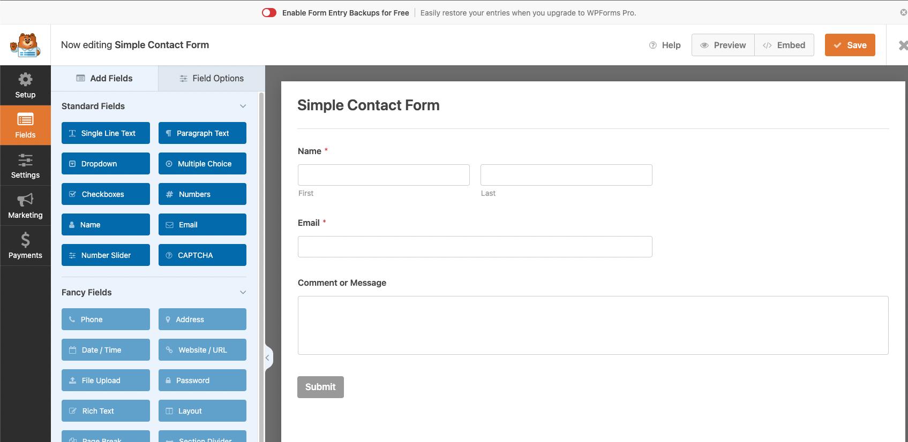
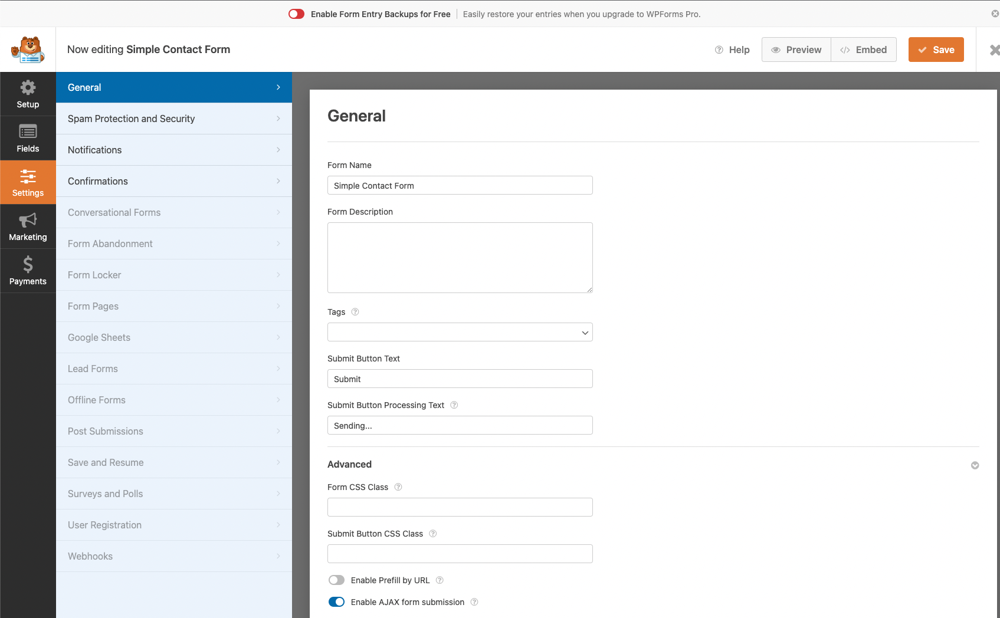
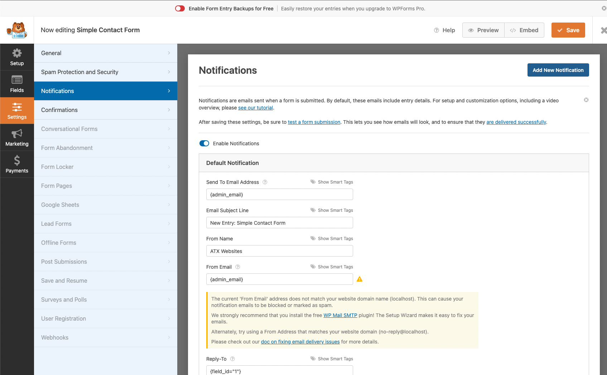
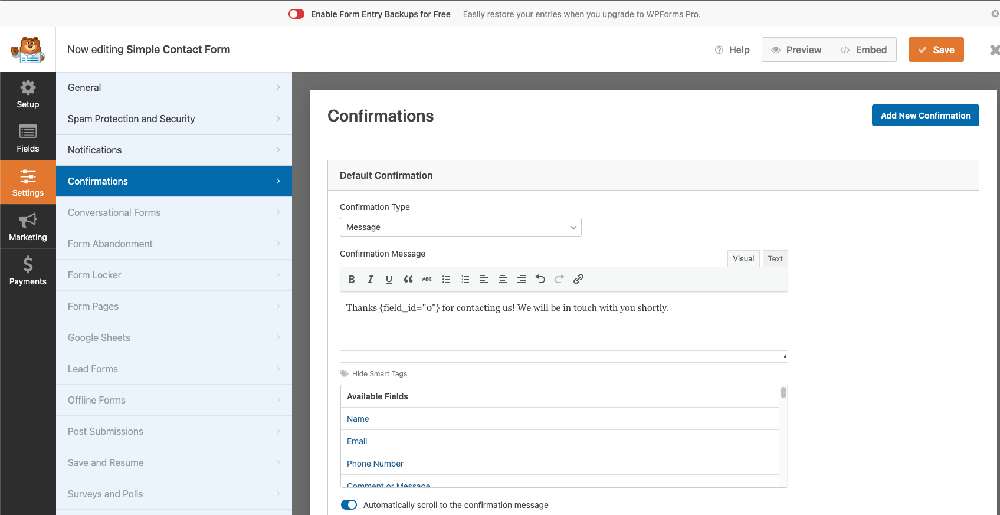
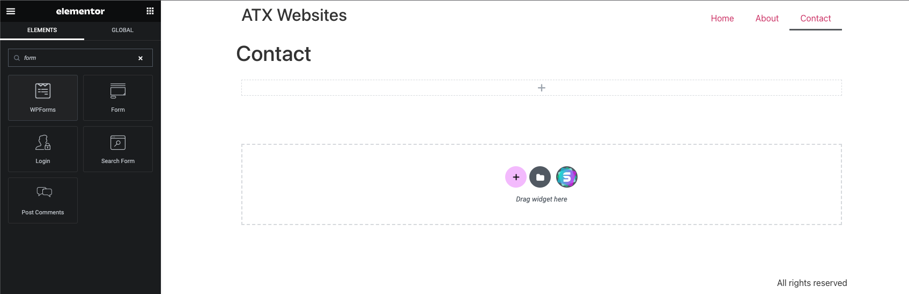
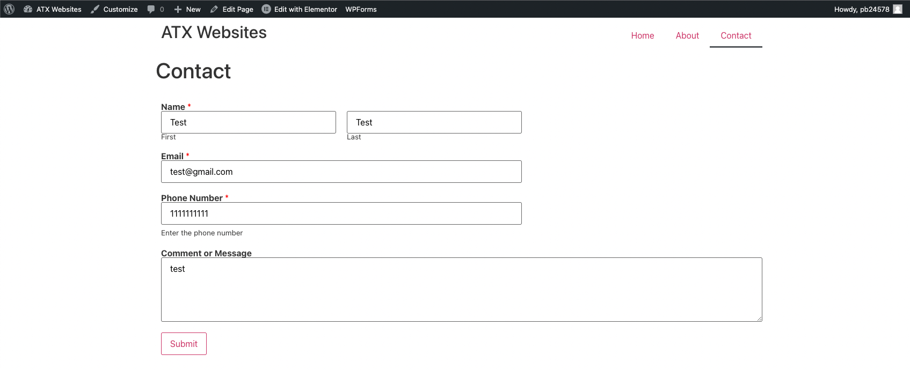

# WPForms
[WPForms](https://wpforms.com/) is a Wordpress plugin that builds forms on your website using a drag and drop builder. WPForms is a great plugin to create Lead forms, which are online forms used to collect information from potential clients called "leads". Using WPForms, we can create a Contact Me form for a potential client to input their information and send you an email with their details.

### Create Contact Form
Let's start off by creating a new Contact form using the plugin. First, in the plugin menu, click "Add New":

Now you'll see a catalog of template forms to use, but let's use the Simple Contact Form template:

Now you can use the form bulder to build the form. There are some fancy fields that you'll need to buy with the Pro version:

Let's add a new field called the "Phone Number" field:

Now in the Settings tab of the form, you have several options for the form. From the General settings, you can set the form name, description, submit button text, etc. You also have advanced options to set the form's CSS styling:

The [Notifications settings](https://wpforms.com/docs/setup-form-notification-wpforms/) is the notification to send (e.g. email) when the user completes the form. The free version of WPForms only allows email notifications:

Let's go to the [Confirmations settings](https://wpforms.com/docs/setup-form-confirmation-wpforms/) and make a personalized message when the user completes the form:

- The form uses the smart tag `{field_id="0"}` referring to the First and Last name
- Sample confirmation message: "Thanks Pravat Bhusal for contacting us! We will be in touch with you shortly."

### Elementor with WPForms
Elementor uses WPForms to create the form elements. We can add our Simple Contact Form that we created from the previous step into our website.

Search for "form" and find the "WPForms" element in Elementor:

Select the Contact Form that we created, then it should load up on the page:

Now if you publish your website and go to the Contact page, you'll see the Contact Form that we created. Let's fill out some info in the form:

And if you click submit, you'll see the confirmation text we had setup:

