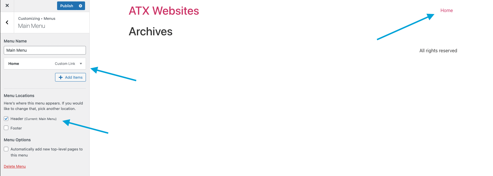

# Theme
A wordpress theme is the foundation of the site's appearance: header, footer, and sidebar. The theme is a global layout that affects the design of your website. Every page on your website will use the same theme on your website.

There are a few popular themes, some of which integrate well with Page Builders like Elementor and Divi:
1. [Hello](https://elementor.com/products/hello-theme/) - Default theme for Elementor
2. [Divi](https://www.elegantthemes.com/gallery/divi/) - Default theme for Divi
3. [Astra](https://wpastra.com/) - Lightweight theme that integrates well with Elementor
4. [OceanWP](https://oceanwp.org/) - Highly customizable theme with many features for free

### Theme Customizer
Wordpress has a built-in theme customizer to allow you to edit the sections of your website's theme.

For example, here's the Hello theme in the customizer:

The basic Hello theme gives you the ability to edit:
1. Site Identity - Logo, Title of site, Subtitle of site, favicon
2. Menus - Links to pages in the header/footer
3. Header & Footer - Header section and Footer section of website
4. Additional CSS - additional global CSS

Below is an example of Menus setting showing the Home link in the Header:

